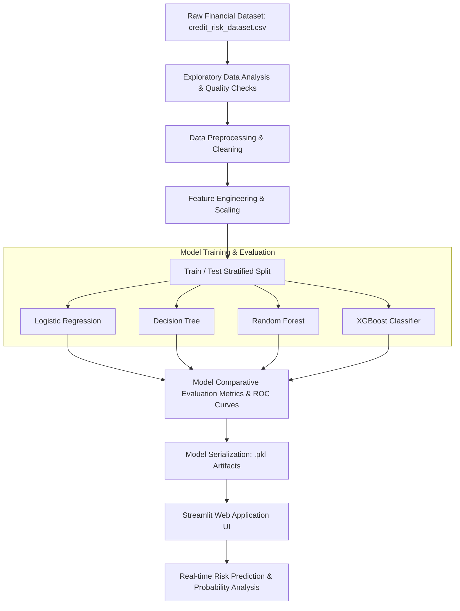
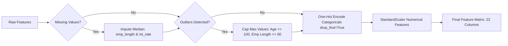
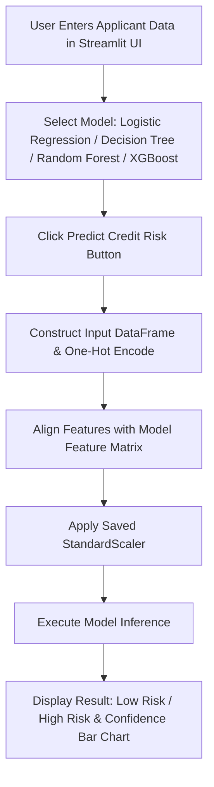

Credit Scoring Model

> **Domain:** FinTech / Predictive Analytics / Machine Learning  
> **Project:** Credit Risk Assessment and Scoring System  

---

## 📌 Executive Summary

This repository contains the end-to-end implementation of a **Credit Scoring Model** developed for **Task 1** of the **Horizon TechX Internship Program**. 

The goal of this project is to build a machine learning model capable of evaluating applicant creditworthiness and predicting default risk (`loan_status`), minimizing financial risk for lenders while facilitating automated loan approval decisions.

The project encompasses the complete data science lifecycle: raw data exploration, missing value imputation, outlier handling, feature encoding and scaling, multi-algorithm training (Logistic Regression, Decision Tree, Random Forest, and XGBoost), rigorous model evaluation, and deployment via an interactive **Streamlit** web application.

---

## 🎯 Key Objectives

1. **Exploratory Data Analysis (EDA):** Identify dataset distributions, missingness patterns, and outliers across applicant financial attributes.
2. **Robust Data Preprocessing:** Implement standard median imputation, outlier capping, dummy encoding, and standard scaling without data leakage.
3. **Multi-Model Comparison:** Train and evaluate classification algorithms ranging from baseline linear models to advanced ensemble methods.
4. **Metric Optimization:** Maximize prediction reliability using **Accuracy**, **Precision**, **Recall**, **F1-Score**, and **ROC-AUC**.
5. **Production-Ready Web App:** Deploy an interactive Streamlit application allowing users to input applicant details, pick trained models, and view risk classifications with confidence probabilities.

---

## 🏗 System Architecture & Workflow

The end-to-end system follows a modular architecture divided into data preparation, model engineering, artifact serialization, and web application inference.



---

## 📊 Dataset Overview & EDA Insights

The model is trained on the **Credit Risk Dataset** (`credit_risk_dataset.csv`), containing **32,581 records** and **12 feature attributes**.

### Feature Dictionary

| Feature Name | Type | Description |
| :--- | :--- | :--- |
| `person_age` | Numerical | Age of the applicant (years) |
| `person_income` | Numerical | Annual income of the applicant (\$) |
| `person_home_ownership` | Categorical | Home ownership status (`RENT`, `OWN`, `MORTGAGE`, `OTHER`) |
| `person_emp_length` | Numerical | Employment length in years |
| `loan_intent` | Categorical | Purpose of the loan (`EDUCATION`, `MEDICAL`, `PERSONAL`, `VENTURE`, `HOMEIMPROVEMENT`, `DEBTCONSOLIDATION`) |
| `loan_grade` | Categorical | Credit grade assigned to loan (`A` through `G`) |
| `loan_amnt` | Numerical | Requested loan amount (\$) |
| `loan_int_rate` | Numerical | Loan interest rate (%) |
| `loan_percent_income` | Numerical | Ratio of loan amount to applicant annual income |
| `cb_person_default_on_file` | Categorical | Historical default on record (`Y`, `N`) |
| `cb_person_cred_hist_length` | Numerical | Credit history length (years) |
| **`loan_status`** *(Target)* | Binary | `0` = Non-default (Low Risk), `1` = Default (High Risk) |

### Class Distribution
- **Non-default (`0`):** ~78.2%
- **Default (`1`):** ~21.8%

---

## ⚙️ Data Preprocessing & Pipeline Flow

Data preparation ensures clean inputs for training and real-time prediction.



1. **Missing Value Imputation:**
   - `person_emp_length` (895 missing): Imputed with median value (~4.0 years).
   - `loan_int_rate` (3,116 missing): Imputed with median value (~10.99%).
2. **Outlier Capping:**
   - Capped `person_age` at 100 years.
   - Capped `person_emp_length` at 60 years.
3. **Categorical Encoding:**
   - One-hot encoded categorical variables using `pd.get_dummies(..., drop_first=True)` to eliminate multicollinearity.
4. **Feature Scaling:**
   - Normalized numerical features using `StandardScaler` and serialized `scaler.pkl` for inference alignment.

---

## 📈 Model Development & Evaluation Review

Four machine learning models were trained on 80% of the dataset (26,064 samples) and evaluated on a held-out 20% test set (6,517 samples).

### Performance Metrics Summary Table

| Model | Accuracy | Precision | Recall | F1-Score | ROC-AUC | Recommendation |
| :--- | :---: | :---: | :---: | :---: | :---: | :--- |
| **Logistic Regression** *(Baseline)* | 86.79% | 76.89% | 56.40% | 65.07% | 0.8693 | Fast, interpretable linear baseline |
| **Decision Tree Classifier** | 88.94% | 73.63% | **76.79%** | 75.18% | 0.8456 | Captures non-linear rules, higher recall |
| **Random Forest Classifier** | 93.17% | 95.61% | 72.01% | 82.15% | 0.9313 | High precision, strong ensemble performance |
| **XGBoost Classifier** 🏆 | **93.45%** | **96.02%** | 73.00% | **82.94%** | **0.9517** | **Best Overall Model** (Highest Accuracy & ROC-AUC) |

### Key Model Insights
- **XGBoost** achieved the highest overall performance with an **ROC-AUC of 0.9517** and **96.02% Precision**, drastically reducing false positive credit approvals.
- **Random Forest** performed closely behind with robust feature importance representation.
- **Decision Tree** offered the highest recall (76.79%), which is helpful when aggressive risk detection is prioritized.

---

## 🖥 Streamlit Web Application Workflow

An interactive web interface ([app.py](file:///Users/nipunnamburi/Downloads/Coding/Horizon%20TechX%20Internship/Task1/app.py)) was built to provide real-time credit scoring.



### Application Features
- **Dynamic Model Selector:** Switch between all 4 trained model artifacts on the fly.
- **Interactive Input Controls:** Form fields for financial data (Income, Loan Amount, Interest Rate, Employment Length, Credit Grade, Default History).
- **Automated Feature Alignment:** Input re-indexing matching original model feature signatures (`model.feature_names_in_`).
- **Probability Breakdown:** Visualized confidence bar charts indicating exact risk probability.

---

## 📁 Repository Directory Structure

```text
Task1/
│
├── CreditScoringModel.ipynb   # Complete Jupyter Notebook (EDA, Preprocessing, Training & Evaluation)
├── app.py                     # Streamlit Web Application script
├── README.md                  # Internship Review Technical Documentation
│
└── models/
    ├── raw/
    │   └── credit_risk_dataset.csv     # Raw dataset
    └── trained/
        ├── decision_tree_model.pkl       # Serialized Decision Tree
        ├── logistic_regression_model.pkl # Serialized Logistic Regression
        ├── random_forest_model.pkl       # Serialized Random Forest
        ├── xgboost_model.pkl             # Serialized XGBoost model
        └── scaler.pkl                    # Fitted StandardScaler artifact
```

---

## 🚀 Quickstart & Setup Guide

### 1. Environment Setup
Clone the workspace and activate your Python virtual environment:
```bash
cd "Horizon TechX Internship/Task1"
python3 -m venv venv
source venv/bin/activate
```

### 2. Install Dependencies
```bash
pip install pandas numpy scikit-learn xgboost streamlit joblib matplotlib seaborn
```

### 3. Run Jupyter Notebook Analysis
To review model training or execute the notebook end-to-end:
```bash
jupyter notebook CreditScoringModel.ipynb
```

### 4. Launch Streamlit Web Application
```bash
streamlit run app.py
```
Open `http://localhost:8501` in your browser to interact with the application.

---

## 🎓 Internship Project Conclusions & Future Scope

### Conclusions
1. **Gradient Boosting Superiority:** XGBoost demonstrated superior ranking capability (ROC-AUC 0.9517), making it the recommended primary engine for credit evaluation.
2. **Feature Engineering Impact:** Imputation and feature scaling significantly boosted baseline logistic regression stability and model convergence.
3. **End-to-End Delivery:** Delivered a complete ML product from raw dataset analysis to real-time interactive inference.

### Future Scope & Enhancements
- **SMOTE Resampling:** Incorporate Synthetic Minority Over-sampling Technique (SMOTE) to address class imbalance and further boost default recall.
- **Model Explainability (SHAP):** Integrate SHAP (SHapley Additive exPlanations) values in the Streamlit app to explain individual loan decisions to credit analysts.
- **API Deployment:** Wrap the model inside a FastAPI endpoint for REST integration into bank software.

---

*Submitted for Internship Task 1 Evaluation — Horizon TechX Internship Program*
